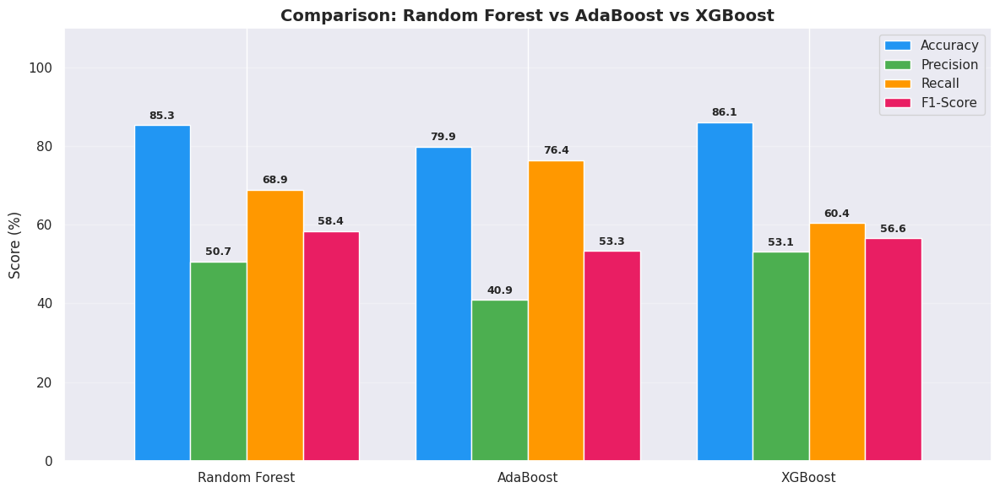
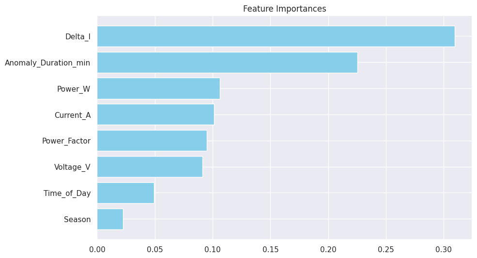

# Data-Driven detection of Abnormal Electricity usage in Power supply Lines

---

## 1. Problem Statement
Electricity theft is a major issue in rural and urban India. People illegally tap distribution lines (pole wires) bypassing the meter, causing financial losses to electricity boards and honest consumers. The goal is to build an ML-based system that detects abnormal electricity consumption patterns automatically.

## 2. Project Structure
- `main.ipynb`: Full research, EDA, and model training.
- `theft_detector.py`: Standalone script for real-time theft detection.
- `models/`: Saved models (`.joblib`) for AdaBoost and Random Forest.
- `assets/`: Performance evaluation graphs and plots.
- `Dataset/`: CSV file containing electrical consumption data.

## 3. Methodology & Progress
- **EDA:** Analyzed 5,000 rows, identifying `Delta_I` and `Power_Factor` as key theft indicators.
- **Balancing:** Used **SMOTE** to handle class imbalance (from 85:15 to 50:50).
- **Comparison:** Evaluated Logistic Regression, RF, XGBoost, LightGBM, and AdaBoost.

## 4. Final Results (Post-SMOTE)
| Model | Accuracy | Precision | Recall (Theft) | F1-Score |
|---|---|---|---|---|
| Random Forest | 85.3% | 50.7% | 68.9% | 0.58 |
| XGBoost | 86.1% | 53.1% | 60.4% | 0.56 |
| **AdaBoost (Champion)** | **79.9%** | **40.9%** | **76.4%** | **0.53** |

---

## 5. Visual Evaluation
### Model Comparison


### Feature Importance


---

## 6. How to Run
1. Install requirements:
   ```bash
   pip install pandas numpy scikit-learn joblib matplotlib seaborn xgboost lightgbm imbalanced-learn
   ```
2. To test the model with real-time scenarios, run:
   ```bash
   python theft_detector.py
   ```

## 7. Conclusion
The project successfully increased theft detection recall to **76.4%** using AdaBoost. This high sensitivity ensures that the majority of illegal tapping cases are flagged for inspection, providing a data-driven solution for utility companies.

**Lead Developer:** Milan Jani
