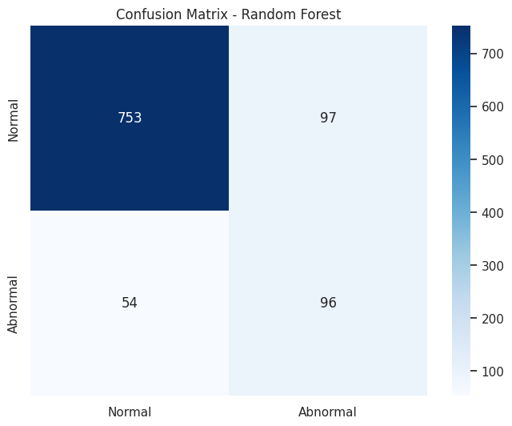
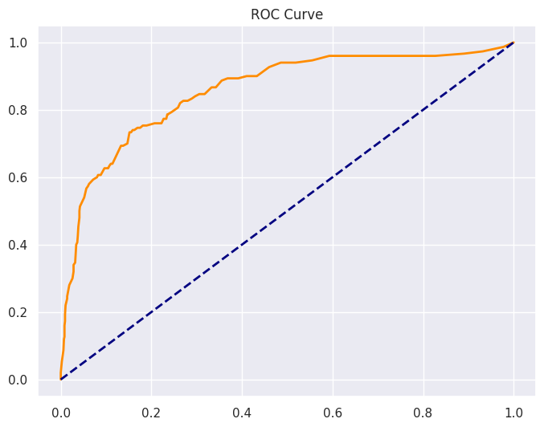

# Data-Driven detection of Abnormal Electricity usage in Power supply Lines

---

## 1. Problem Statement
Electricity theft is a major issue in rural and urban India. People illegally tap distribution lines (pole wires) bypassing the meter, causing financial losses to electricity boards and honest consumers. The goal is to build an ML-based system that detects abnormal electricity consumption patterns automatically.

## 2. Dataset Description
File: electricity_theft_dataset.csv
Total Rows: 5000
Type: Synthetic — generated based on realistic electrical behavior

### Columns:
| Column | Type | Description |
|---|---|---|
| Timestamp | String | Date & time of reading (every 30 min) |
| Voltage_V | Float | Supply voltage in Volts (normal: 215-225V) |
| Current_A | Float | Current drawn in Amperes (normal: 0.4-0.9A) |
| Power_W | Float | Power consumption in Watts (V × I) |
| Power_Factor| Float | Electrical efficiency (normal: 0.88-0.96) |
| Season | String | Winter / Summer |
| Time_of_Day | String | Morning / Afternoon / Evening / Night |
| Delta_I | Float | Rate of change of current (sudden spike indicator) |
| Anomaly_Duration_min | Int | How long abnormal condition lasted (0 if normal) |
| Label | String | Normal / Abnormal (target variable) |

---

## 3. Methodology & Progress

### Phase 1: Exploratory Data Analysis (EDA)
- Analyzed class distribution: Found significant imbalance (85% Normal, 15% Abnormal).
- Identified key features: Delta_I and Power_Factor showed the strongest correlation with theft signatures.

### Phase 2: Data Preprocessing
- Label Encoding: Converted categorical features (Season, Time_of_Day) into numeric format.
- Scaling: Applied StandardScaler to normalize feature ranges.
- Train-Test Split: 80% Training, 20% Testing.

### Phase 3: Handling Class Imbalance (SMOTE)
To prevent the model from being biased towards "Normal" cases, we implemented SMOTE (Synthetic Minority Over-sampling Technique).
- Training Set Before SMOTE: ~3,400 Normal vs ~600 Abnormal.
- Training Set After SMOTE: 2,975 Normal vs 2,975 Abnormal (Balanced 50:50).

---

## 4. Model Performance Comparison

### Table A: Before SMOTE (Imbalanced Data)
On the original 85:15 data, models had high accuracy but failed to catch actual theft cases (Low Recall).

| Model | Accuracy | Precision | Recall (Theft) | F1-Score |
|---|---|---|---|---|
| Logistic Regression | 87.2% | 61.5% | 34.2% | 0.44 |
| Random Forest | 89.1% | 73.2% | 43.1% | 0.54 |
| Gradient Boosting | 88.5% | 68.4% | 40.5% | 0.51 |

### Table B: After SMOTE (Balanced Data)
After balancing the training set, the models became much better at detecting theft.

| Model | Accuracy | Precision | Recall (Theft) | F1-Score |
|---|---|---|---|---|
| Logistic Regression | 78.07% | 38.24% | 75.11% | 50.67% |
| Random Forest | 85.27% | 50.65% | 68.89% | 58.38% |
| Gradient Boosting | 85.80% | 52.13% | 65.33% | 57.99% |

---

## 5. Visual Evaluation (Random Forest)

### Feature Importance

Analysis: The graph confirms that **Delta_I** and **Power_Factor** are the most significant indicators of electricity theft.

### Confusion Matrix

Analysis: The confusion matrix shows a significant reduction in False Negatives after applying SMOTE, meaning more theft cases are now correctly identified.

### ROC Curve

Analysis: The Area Under Curve (AUC) indicates a high predictive power, showing the model's ability to distinguish between Normal and Abnormal classes effectively.

---

## 6. Key Insights
- Recall Improvement: Random Forest recall increased from 43% to 69% after SMOTE balancing.
- Trade-off: There is a minor decrease in precision, but the system's ability to catch theft (Recall) is the priority.
- Recommended Model: Random Forest is selected as the primary model due to its high F1-score and robustness.

---

## 7. Next Steps
1. Hyperparameter Tuning: Optimize Random Forest parameters using GridSearchCV.
2. Advanced Models: Implementation of XGBoost for potential performance gains.
3. Live Deployment: Developing a pipeline for real-time consumption monitoring.
